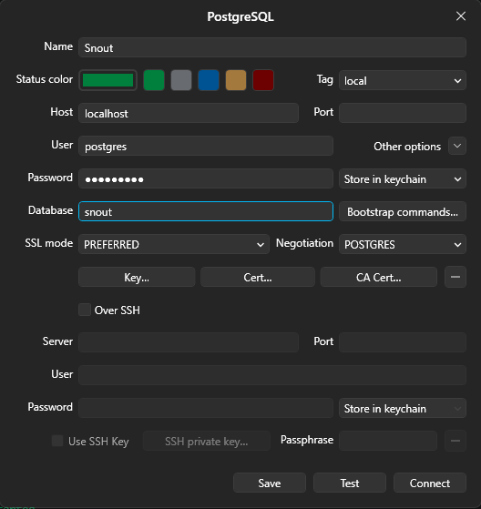

<h1 align="center">Snout API</h1>
<p align="center">
  
</p>

<p align="center">Backend REST API for <a href="https://github.com/hanzeelvilla/snout-app">Snout</a>, built with <a href="https://nestjs.com/">NestJS</a> and TypeScript.</p>

## Description

`snout-api` is the backend service that powers the Snout application. It is built on top of [NestJS](https://nestjs.com/) (v11) and TypeScript, and uses [pnpm](https://pnpm.io/) as its package manager. Data is persisted in a PostgreSQL 17 database, provisioned locally through Docker Compose.

For the client application, see the frontend repository: [hanzeelvilla/snout-app](https://github.com/hanzeelvilla/snout-app).

## Prerequisites

Make sure you have the following installed before setting up the project:

- [Node.js](https://nodejs.org/) 20 LTS or later
- [pnpm](https://pnpm.io/installation)
- [Docker](https://www.docker.com/) and [Docker Compose](https://docs.docker.com/compose/) (used to run the local PostgreSQL database)
- A PostgreSQL client, e.g. [TablePlus](https://tableplus.com/), if you want to inspect the database directly (optional)

## Project setup

1. **Clone the repository**

   ```bash
   git clone git@github.com:hanzeelvilla/snout-api.git
   cd snout-api
   ```

2. **Install dependencies**

   ```bash
   pnpm install
   ```

3. **Configure environment variables**

   Create a `.env` file in the project root (this file is gitignored) with the following variables:

   ```bash
   DB_PORT=5432
   DB_NAME=snout
   DB_PASSWORD=your-password
   ```

   These variables are consumed by `docker-compose.yaml` to configure the local PostgreSQL container.

4. **Start the database**

   ```bash
   docker compose up -d db
   ```

   This starts a `postgres:17` container named `snout-db`, exposed on `${DB_PORT}` (default `5432`), with the database `${DB_NAME}`. Data is persisted to the `./postgres` directory on the host — treat it as generated state, not source, and never edit it by hand.

5. **(Optional) Connect with TablePlus**

   You can inspect the local database using any PostgreSQL client. Below is an example connection using TablePlus with the default values from the `.env` file above (Host: `localhost`, Port: `${DB_PORT}`, User: `postgres`, Database: `${DB_NAME}`):

   <p align="center">
     
   </p>

   > [!Note]
   > The default PostgreSQL user is `postgres`

## Compile and run the project

```bash
# development (no watch)
$ pnpm run start

# watch mode (typical for local dev)
$ pnpm run start:dev

# debug mode (--inspect + watch)
$ pnpm run start:debug

# build
$ pnpm run build

# production mode (runs the compiled dist/main.js)
$ pnpm run start:prod
```

By default the app listens on `http://localhost:3000` (configurable via the `PORT` environment variable).

## Run tests

```bash
# unit tests
$ pnpm run test

# unit tests in watch mode
$ pnpm run test:watch

# test coverage
$ pnpm run test:cov

# e2e tests
$ pnpm run test:e2e

# unit tests under the node inspector
$ pnpm run test:debug
```

To run a single unit test file: `pnpm test -- app.controller.spec.ts`.
To run a single e2e test file: `pnpm run test:e2e -- test/app.e2e-spec.ts`.

## Lint and format

```bash
# lint (auto-fixes issues)
$ pnpm run lint

# format with Prettier
$ pnpm run format
```

## Related repositories

- Frontend / client app: [hanzeelvilla/snout-app](https://github.com/hanzeelvilla/snout-app)

## Resources

Check out a few resources that may come in handy when working with NestJS:

- Visit the [NestJS Documentation](https://docs.nestjs.com) to learn more about the framework.
- To dive deeper and get more hands-on experience, check out the official [courses](https://courses.nestjs.com/).
- Visualize your application graph and interact with the NestJS application in real-time using [NestJS Devtools](https://devtools.nestjs.com).

## License

This project is UNLICENSED (private).
